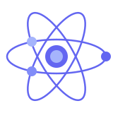

<div align="center">
  
  <h1>Atom UI</h1>
  <p>Vue 3 uchun yengil, tezkor va to'liq nazorat qilinadigan komponentlar kutubxonasi</p>

[](https://www.npmjs.com/package/@atom-ui/vue)
[](./LICENSE)
[](https://vuejs.org)
[](https://typescriptlang.org)

</div>

---

## 🇺🇿 O'zbek

**Atom UI** — Vue 3 uchun yaratilgan yengil, tezkor va reusable komponentlar kutubxonasi.

### O'rnatish

```bash
pnpm add @atom-ui/vue
# yoki
npm install @atom-ui/vue
# yoki
yarn add @atom-ui/vue
```

### Ulash

```ts
import { createApp } from "vue";
import AtomUI from "@atom-ui/vue";
import "@atom-ui/vue/style.css";
import App from "./App.vue";

const app = createApp(App);
app.use(AtomUI);
app.mount("#app");
```

### Ishlatish

```vue
<template>
  <AtomButton variant="primary">Salom!</AtomButton>
  <AtomInput v-model="value" placeholder="Kiriting..." />
</template>
```

### Komponentlar

| Komponent     | Tavsif        |
| ------------- | ------------- |
| `AtomButton`  | Tugma         |
| `AtomInput`   | Matn kiritish |
| `AtomTabs`    | Tablar        |
| `AtomModal`   | Modal oyna    |
| `AtomPopover` | Popover       |

### Havolalar

- 📦 [npm](https://www.npmjs.com/package/@atom-ui/vue)
- 📖 [Dokumentatsiya](https://atom-ui.dev)
- 🐛 [Issue qoldirish](https://github.com/Foz1ljon/atom-ui/issues)

---

## 🇷🇺 Русский

**Atom UI** — лёгкая, быстрая и reusable библиотека компонентов для Vue 3.

### Установка

```bash
pnpm add @atom-ui/vue
# или
npm install @atom-ui/vue
# или
yarn add @atom-ui/vue
```

### Подключение

```ts
import { createApp } from "vue";
import AtomUI from "@atom-ui/vue";
import "@atom-ui/vue/style.css";
import App from "./App.vue";

const app = createApp(App);
app.use(AtomUI);
app.mount("#app");
```

### Использование

```vue
<template>
  <AtomButton variant="primary">Привет!</AtomButton>
  <AtomInput v-model="value" placeholder="Введите текст..." />
</template>
```

### Компоненты

| Компонент     | Описание       |
| ------------- | -------------- |
| `AtomButton`  | Кнопка         |
| `AtomInput`   | Поле ввода     |
| `AtomTabs`    | Вкладки        |
| `AtomModal`   | Модальное окно |
| `AtomPopover` | Поповер        |

### Ссылки

- 📦 [npm](https://www.npmjs.com/package/@atom-ui/vue)
- 📖 [Документация](https://atom-ui.dev)
- 🐛 [Создать Issue](https://github.com/Foz1ljon/atom-ui/issues)

---

## 🇬🇧 English

**Atom UI** — a lightweight, fast and reusable component library for Vue 3.

### Installation

```bash
pnpm add @atom-ui/vue
# or
npm install @atom-ui/vue
# or
yarn add @atom-ui/vue
```

### Setup

```ts
import { createApp } from "vue";
import AtomUI from "@atom-ui/vue";
import "@atom-ui/vue/style.css";
import App from "./App.vue";

const app = createApp(App);
app.use(AtomUI);
app.mount("#app");
```

### Usage

```vue
<template>
  <AtomButton variant="primary">Hello!</AtomButton>
  <AtomInput v-model="value" placeholder="Type something..." />
</template>
```

### Components

| Component     | Description  |
| ------------- | ------------ |
| `AtomButton`  | Button       |
| `AtomInput`   | Text input   |
| `AtomTabs`    | Tabs         |
| `AtomModal`   | Modal dialog |
| `AtomPopover` | Popover      |

### Links

- 📦 [npm](https://www.npmjs.com/package/@atom-ui/vue)
- 📖 [Documentation](https://atom-ui.dev)
- 🐛 [Report an issue](https://github.com/Foz1ljon/atom-ui/issues)

---

## License

[MIT](./LICENSE) © 2025 Foz1ljon
